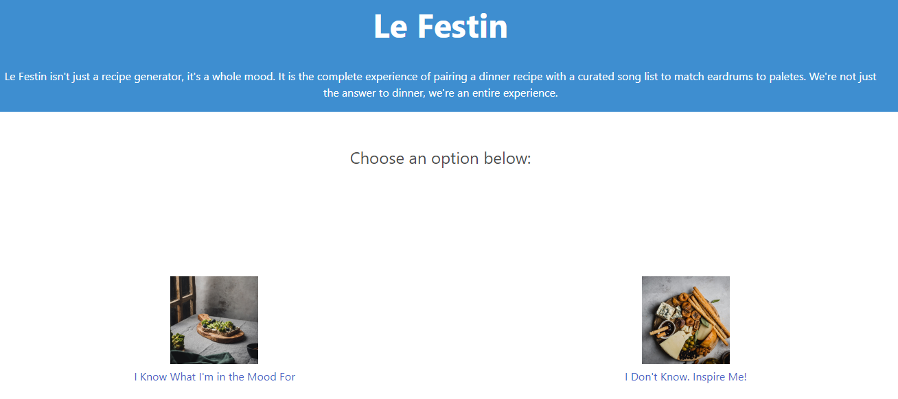

# Le Festin

## Purpose
A website that provides users access to random recipies either via cuisine search or complety by random via TheMealDB API. When users are presented with a recipe, they are also provided a corresponding Youtube playlist that can be played while the user cooks the recipe. Overall, the goal is less decision making & a quality cooking experience.

## Built With
* HTML
* CSS
* JAVASCRIPT
* Bulma

## Website
https://7krich.github.io/project01/

## Screenshots

